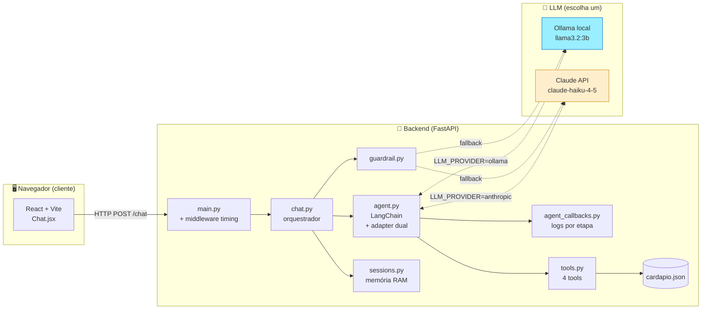
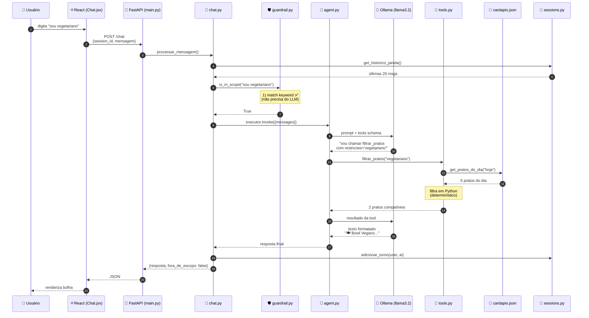
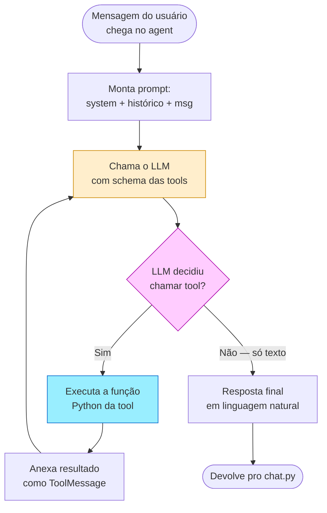
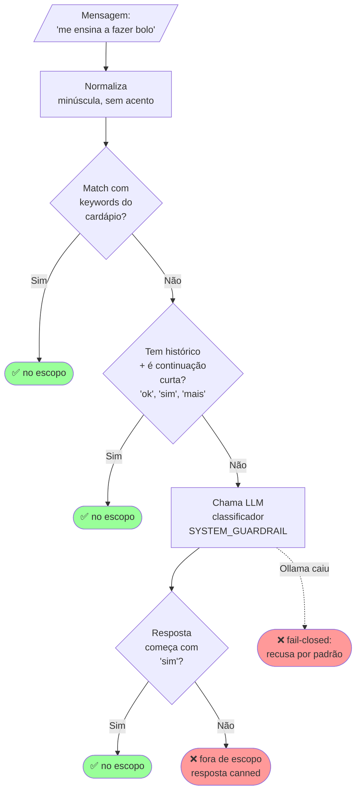
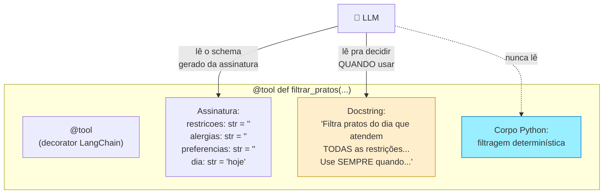
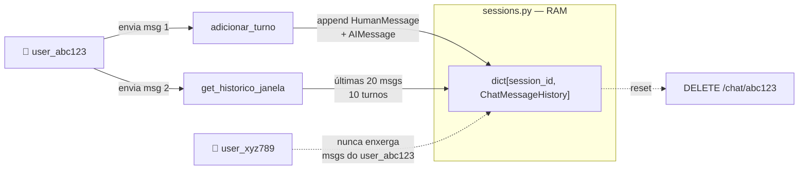
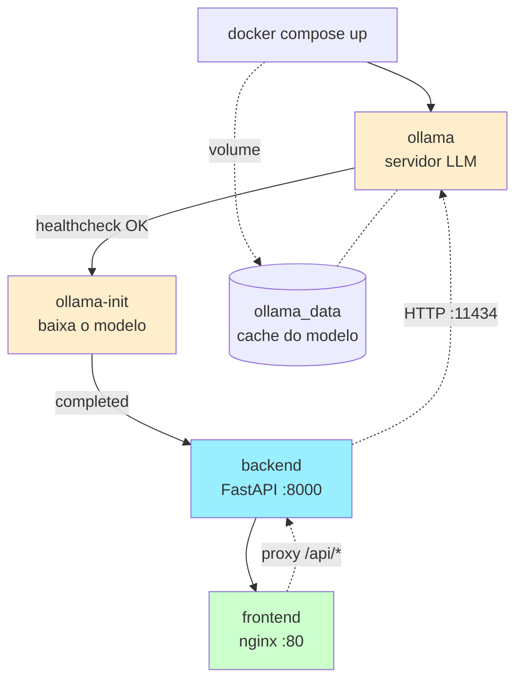
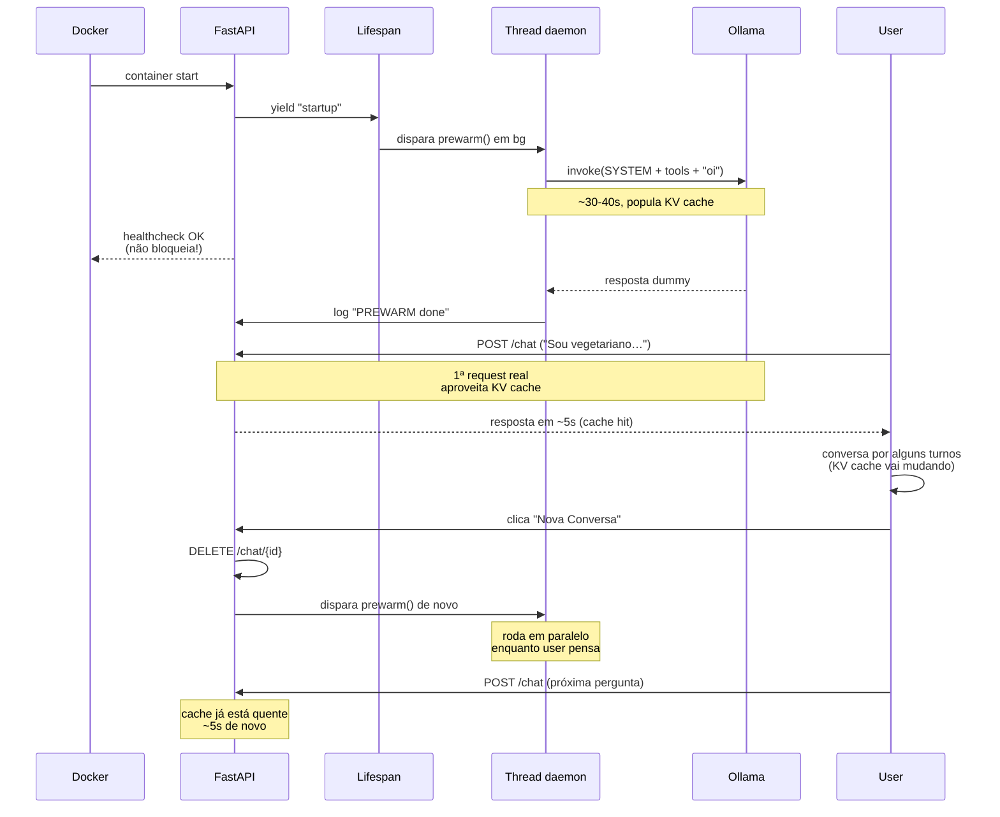
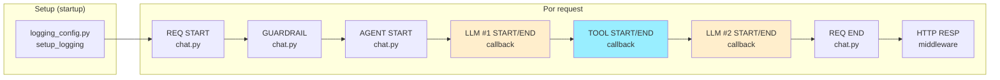
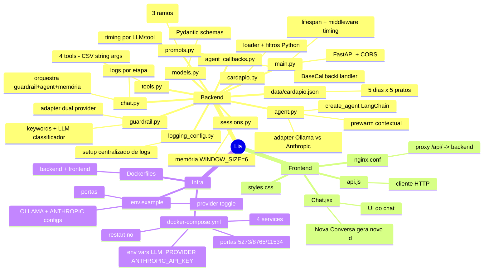

# Mapa Conceitual — Flow do Chat IA da Lia

> Esse documento mostra **visualmente** como uma mensagem do usuário vira uma recomendação. Use os diagramas no quadro durante a videoaula. Todos são em Mermaid — renderizam direto no GitHub/VS Code.

---

## 1. Visão de alto nível: as 3 camadas



**Leia esse diagrama assim:**
1. **Navegador** envia uma mensagem por HTTP.
2. **Backend** (FastAPI) recebe, passa pelo middleware de timing, depois pro orquestrador (`chat.py`).
3. Orquestrador chama o **guardrail** (filtra fora-de-escopo).
4. Se passou, chama o **agent** (LangChain), que conversa com o **LLM escolhido** e usa **tools** quando necessário.
5. O **adapter** em `agent.py` decide o provider via `LLM_PROVIDER`: Ollama local OU Claude API.
6. **Tools** leem o `cardapio.json` (verdade absoluta sobre os pratos).
7. **Callbacks** logam cada chamada de LLM e tool com timing.
8. Resposta volta pelo mesmo caminho.

---

## 2. Sequência detalhada de uma mensagem (caminho feliz)



---

## 3. O loop interno do Agent (a parte "mágica" do LangChain)

> É AQUI que mora o tool calling. Mostre essa parte com calma.



**O ponto-chave que confunde iniciantes:**
- O LLM **não executa código**. Ele só **escreve um JSON** dizendo "quero chamar X com argumentos Y".
- O LangChain pega esse JSON, **executa a função Python**, e devolve o resultado pro LLM.
- O LLM olha o resultado e decide: chamar outra tool? Já tem o suficiente pra responder?
- Esse loop pode rodar 1 ou várias vezes. No nosso caso, geralmente 1–2 voltas.

---

## 4. Guardrail em duas camadas



**Por que duas camadas?**
- **Keyword é instantânea (~0ms)**, mas falsos negativos: "preciso de algo gostoso e nutritivo" não tem `cardapio` mas é válido.
- **LLM cobre o resto (~500ms)**, mas é caro chamar pra TODA mensagem.
- **Combinando**: 90% das mensagens nunca chegam no LLM classificador. Só os casos ambíguos.

---

## 5. Estrutura de uma Tool (anatomia)



**Aprendizado:**
- O **schema dos argumentos** vem dos tipos Python (a IA entende `str`, `int`, `list[dict]`, etc).
- A **docstring é o "manual de uso" pro LLM**. Reescrever a docstring → muda o comportamento.
- O **corpo da função** o LLM nunca vê — é segurança: ele não pode "manipular" código que não enxerga.

---

## 6. Memória de conversa



**Pontos:**
- **Sessão = chave** (`session_id`). Frontend gera UUID, salva no `localStorage`.
- **Janela de 20 mensagens** = LLM recebe só as últimas 10 trocas (custo de token + relevância).
- **Volátil**: reiniciou backend, perdeu memória. **SQLite é o próximo passo**.

---

## 7. Flow do Docker Compose



**Ordem garantida pelo `depends_on`:**
1. `ollama` sobe e fica esperando pull.
2. `ollama-init` (uma vez só) verifica/baixa o modelo, então **encerra** (`restart: "no"`).
3. `backend` e `frontend` só sobem depois disso.

---

## 8. Adapter dual de provider (Ollama vs Anthropic)

```mermaid
flowchart TD
    START([backend startup]) --> READ[Lê env LLM_PROVIDER]
    READ --> DEC{LLM_PROVIDER<br/>= ?}

    DEC -->|"ollama"<br/>(default)| LCO[from langchain_ollama<br/>import ChatOllama]
    LCO --> CFGO[ChatOllama com<br/>num_ctx=2048<br/>keep_alive=30m<br/>num_predict=512]
    CFGO --> AGENT_O[create_agent<br/>tools+system_prompt]
    AGENT_O --> PWO[prewarm thread<br/>~30-40s]
    PWO --> READY_O[Ready: ~30s/turno]

    DEC -->|"anthropic"| KEY{ANTHROPIC_API_KEY<br/>setada?}
    KEY -->|não| ERR[RuntimeError:<br/>API key ausente]
    KEY -->|sim| LCA[from langchain_anthropic<br/>import ChatAnthropic]
    LCA --> CFGA[ChatAnthropic com<br/>max_tokens=512]
    CFGA --> AGENT_A[create_agent<br/>tools+system_prompt]
    AGENT_A --> SKIP[prewarm SKIP<br/>cloud não tem cold start]
    SKIP --> READY_A[Ready: ~3s/turno]

    style LCO fill:#9ef,stroke:#06c
    style READY_O fill:#9ef,stroke:#06c
    style LCA fill:#fec,stroke:#c80
    style READY_A fill:#fec,stroke:#c80
    style ERR fill:#f99,stroke:#900
```

**Mensagem-chave:** o `executor` (criado por `create_agent`) tem a mesma interface independente do provider. As tools, o guardrail, o frontend, o cardápio — nada disso muda. Trocar de Ollama pra Anthropic é literalmente uma env var + rebuild do backend.

---

## 9. Lifecycle do backend (prewarm e reprewarm)



**Pontos:**
- **prewarm no startup**: thread daemon, não bloqueia healthcheck do Docker
- **reprewarm no DELETE**: aproveita o intervalo humano (5–10s pensando) pra esquentar o cache
- **Para Anthropic**: prewarm é skipped (`PREWARM skipped | provider=anthropic`)

---

## 10. Pipeline de observabilidade (logs estruturados)



**Output típico:**

```
20:39:55.171 | chat   | REQ START   | session=user_xyz | msg='...'
20:39:55.171 | chat   | +0.00s | GUARDRAIL  | in_scope=True
20:39:55.180 | agent  | +0.01s | LLM #1 START   | chars_in=2634
20:39:56.948 | agent  | +1.78s | LLM #1 END     | dur=1.77s
20:39:56.949 | agent  | +1.78s | TOOL START      | name=filtrar_pratos
20:39:56.950 | agent  | +1.78s | TOOL END        | dur=0.00s
20:39:56.958 | agent  | +1.79s | LLM #2 START
20:39:59.100 | agent  | +3.93s | LLM #2 END     | dur=2.14s
20:39:59.100 | chat   | +3.93s | REQ END    | total=3.93s
20:39:59.101 | api    | HTTP RESP   | total_handler_ms=3930
```

Cada linha responde uma pergunta diferente: "onde foi o tempo?", "qual tool foi chamada?", "o LLM falhou?", "houve gap entre LLM terminar e HTTP responder?".

---

## 11. Resumo: o que cada arquivo faz



---

## Como usar este documento na videoaula

| Bloco do roteiro | Diagrama recomendado |
|---|---|
| **2 — Stack** | #1 (visão de alto nível com adapter dual) |
| **5 — Tools** | #3 (loop do agent), #5 (anatomia da tool) |
| **6 — Guardrail** | #4 (duas camadas) |
| **7 — Observabilidade** | #10 (pipeline de logs) |
| **8 — Frontend HTTP** | #2 (sequência completa) |
| **9 — Docker** | #7 (ordem dos containers), #9 (lifecycle prewarm) |
| **10 — Local vs Cloud** | #8 (adapter dual de provider) |
| **Recap final** | #11 (mindmap dos arquivos) |

> **Dica:** se for gravar a tela do Mermaid renderizando ao vivo (no VS Code com a extensão Markdown Preview Mermaid Support), gera um efeito de "ah, então é isso que cada arquivo faz" muito mais forte do que slide estático.
